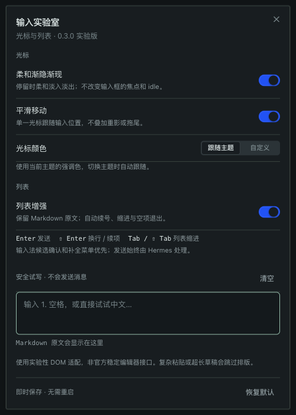
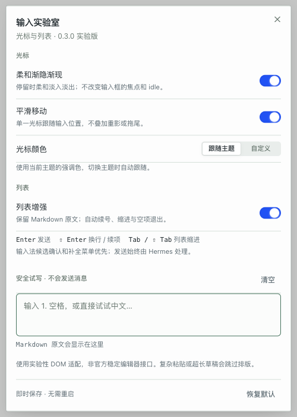

# Composer Lab · 输入实验室

Experimental caret styling and Markdown list enhancements for **Hermes Desktop**.
MIT licensed, local-only, no telemetry, no core patches or application rebuilds.

> **Unofficial / experimental.** This plugin uses unsupported composer DOM adapters and does **not** pass the official catalog's desktop-surface validator. It is not approved by Nous Research. Read [compatibility and policy](docs/COMPATIBILITY.md) before installing. Settings UI is currently in Chinese.

## 功能

- **柔和渐隐渐现**：只动画原生 `caret-color`，不改变正文颜色，不增加停顿计时，不主动获取焦点。开启后会替换浏览器原本的硬闪烁节奏，但不会接管 Hermes 输入框的 idle 状态。
- **主题色 / 自定义色**：默认跟随主题强调色；也可用颜色选择器或六位十六进制颜色。颜色、渐变和平滑移动分别可调。
- **单一光标平滑移动**：过渡期间临时隐藏原生光标，结束后移除浮层；没有拖尾。组字期间跟随选区焦点，候选确认仍由输入法处理。
- **Markdown 列表**：用 CodeMirror 的 Markdown 语法树识别列表，列表符号只用浏览器原生“文字高亮”上色，**不改动输入框结构**；续号、嵌套、提升、空项退出只改行首空格和编号，正文、`-`/`+`/`*`、`1)`、任务框原样保留。
- **原生风格设置**：Hermes SDK 的 Dialog、Button、Switch、Input 和 SegmentedControl；立即保存、恢复默认、安全试写区。系统“减少动态效果”会停用光标动效。

| 操作            | 原输入框中的行为                              |
| --------------- | --------------------------------------------- |
| Enter           | 宿主发送；输入法候选确认优先                  |
| Shift+Enter     | 换行；列表内续项，空项退出                    |
| Tab / Shift+Tab | 仅列表行缩进 / 退级；普通文本和补全菜单不抢占 |
| Backspace       | 紧跟在列表符号后时退级 / 去掉符号；其余位置为普通删除 |
| ⌘ Backspace     | 列表行内删除正文、保留符号；折行时保持系统行为 |
| 设置试写区      | Enter 也只换行，不发送消息                    |

## 设置预览

隔离测试截图：使用实际 Hermes SDK 组件和示例深浅主题，非真实聊天会话。

 

## 安装

需要 Hermes Desktop 的磁盘插件支持和当前 SDK UI 组件。仅验证过 macOS / Electron 的隔离测试，其他平台和不同宿主版本尚未验证。

审查代码后，克隆此仓库并在仓库根目录执行（Node.js 22+）：

```sh
npm ci --ignore-scripts
npm test
npm run build
npm run install:desktop
```

已有安装时，明确使用：

```sh
npm run install:desktop -- --replace
```

安装器只替换 `$HERMES_HOME/desktop-plugins/composer-lab/plugin.js`（未设置 `HERMES_HOME` 时使用 `~/.hermes`），不会改应用、其他插件或用户配置。替换前保留一份本地旧 bundle 到被 git 忽略的 `.local/previous-plugin.js`，并核对安装文件 SHA-256。也可直接把仓库中的 `desktop/` 文件复制到上述插件目录。

Hermes 会热加载。点击输入区 **Aa**，或命令面板搜索 **输入实验室：光标与列表设置**（没有打开对话的页面也能用）。

这不是官方目录插件，不提供自更新器。更新需自行审查新提交，再执行安装。`package.json` 的 `private: true` 仅防止误发 npm，不影响本仓库的 MIT 开源许可。

### 关闭 / 卸载

光标平滑、渐隐和列表可分别关闭。切回“跟随主题”清除自定义配色的应用。

完全卸载：退出 Hermes，把 `desktop-plugins/composer-lab` 文件夹移出插件根目录，再打开应用。无需删除聊天数据或改宿主配置。热卸载清理也是测试范围的一部分。

## 开发与验证

```sh
npm ci --ignore-scripts
npm test                 # 纯逻辑与源码安全契约
npm run build            # 只构建插件，不构建 Hermes
```

需要隔离 Electron / 宿主契约测试时，设置以下路径为你已有的 Hermes checkout 和 Electron 可执行文件。**不会自动下载 Electron 或连接真实聊天后端。**

```sh
export HERMES_SOURCE="/path/to/hermes-agent"
export HERMES_ELECTRON_PATH="/path/to/electron-executable"
# 可将 TMPDIR 指向自己的临时工作目录
npm run build
npm run test:electron
```

宿主 checkout 需已有桌面依赖和 `apps/desktop/dist/assets/index-*.css`。开发 fixture 引用宿主 serializer、undo hook 和 UI 组件；测试输出留在 `$TMPDIR/composer-lab-tests`。fixture 的注册、存储、通知和发送回调是测试替身，不是完整 Hermes 会话。

参见 [测试边界与安全修复](docs/SAFETY.md)。Chromium preedit 测试不等于实际 macOS 中文候选窗口的端到端验收。

## 项目结构

- `src/caret.js`：临时移动浮层、主题色与原生光标样式生命周期。
- `src/editor.js`：列表高亮（CSS Custom Highlight API）、列表按键、宿主输入 / undo 桥接。
- `src/markdown.js`：CodeMirror Markdown 语法树与续项命令。
- `src/list-structure.js`：按行的缩进 / 退级 / 重新编号，只改行首。
- `src/plugin.js`：SDK 注册、主题 CSS、设置与安全试写区。
- `src/settings.js`：存储迁移、默认值与颜色校验。
- `desktop/plugin.js`：可安装的单文件 ESM bundle。
- `desktop/THIRD_PARTY_NOTICES.txt`：构建时提取的全部已打包依赖许可证。

## 许可与来源

原创部分为 [MIT](LICENSE)。CodeMirror、Lezer 及传递依赖保留各自许可；参见第三方 notices。开发测试按路径引用宿主源文件，但不把 Hermes 源码或样式表重新发布到插件 bundle。
